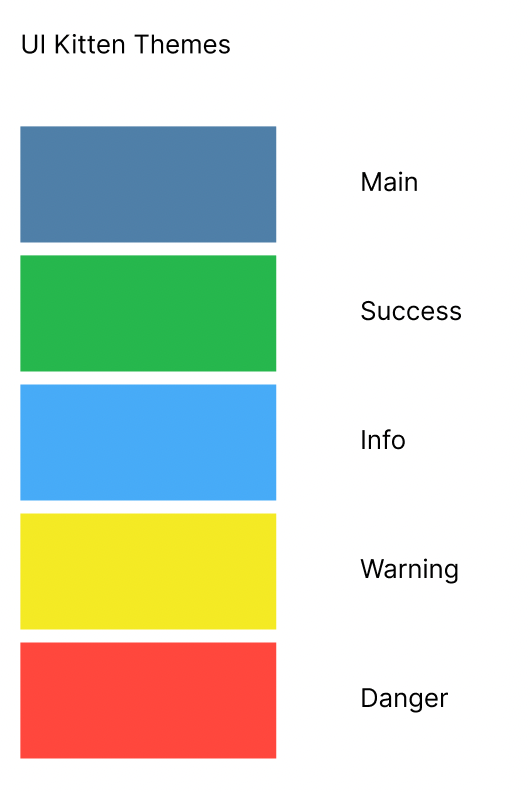

# PhotoSphere
This is a project done for Orbital 2022, Apollo level.

# Software and tools used
- Figma (Design and UI)
- Expo (For easy testing and deployment)
- UI Kitten (UI kit)
- React-native (iOS and Android)
- Django (backend)
- Google firestore (Database and file storage)

# Use cases
- User wants to convert panoramic images from the camera to high quality 360 images
- User wants to view 360 images in the app using basic VR hardware (such as google cardboard)
- User wants to share 360 images to their friends
- User wants to geotag their 360 images to iconic scenes around the world, to have a glance of where they have been to

# Structure and Design
## Git Flow
Since our project team is only 2 people (very small), we decided to keep branching simple, rather than create branches for different features. The onus is on us to communicate through discord/ issues tab, as well as to make regular commits with meaningful commit messages. Here are the branches we will keep to:
- main: For releases (For milestones/ pushing out, monthly)
- develop: Weekly merging & testing, ensure all main functions work
- dev-chai/ dev-hosea: 


## UI

### Colours
The main colours that we will be using are  
  
For more details, checkout our [themes.json File](frontend/theme.json)

### Fonts
This has yet to be fully decided

## Frontend
For our frontend, we used React-native because it can be used to create dynamic apps for android, iOS and web. Furthermore, there are many libraries offered, including WebXR that will allow us easier access to many functions.  
**NEW UPDATE** We will be transitioning this project out of expo in order to support VR. More info found in the respective [README](./vrfrontend/README.md)

### Folder structure (Only relevant sections)
```
frontend
├── src
│   ├── Components
│   │   ├──
│   │   ├── 
│   │   └── 
│   │
│   │
│   ├── Containers
│   │   ├── 
│   │   ├── 
│   │   └── 
│   │
│   │
│   ├── Navigation
│   │   ├── 
│   │   ├── 
│   │   └── 
│   │
│   │
│   ├── utils
│   │   ├── emailValidator.js
│   │   ├── nameValidator.js
│   │   └── passwordValidator.js
│   │
│   │
│   └── friends: [ Reference, ]
│
├── theme.json
├── mapping.json
└── App.js
```
- Components are used to store reusable components within the whole project (can be split into subfolder for clearer structure)
- Containers are used to store different pages within the whole project (can be split into subfolder for clearer structure)
- Navigation is used to denote how the app routes from page to page (can be split into subfolder for clearer structure)
- utils is used to store chunks of logic or access to other APIs that is used throughout the project (can be split into subfolder for clearer structure)
- theme.json: Colours
- mapping.json: Fonts
- App.json: initialising other tools to be used throughout the app

## Google firestore
Compared to the alternative cloud options (like AWS, DigitalOcean, Heroku, etc), we landed with google for a few reasons:
1. Interesting database structure (Firestore internally optimises the storage of data for scaling and reading)
2. 80GB storage offered (without charge) for other assets

### Database Design (Collection-Document System)
```
Database
├── Users
│   ├── username: String
│   ├── firstname: String
│   ├── lastname: String
│   ├── password_hash: String
│   ├── Spheres
│   │   ├── uploaded: Date
│   │   ├── verified: Date
│   │   └── filepath: String
│   │
│   │
│   └── friends: [ Reference, ]
│
└── Spheres
    ├── uploaded: Date
    ├── verified: Date
    └── filepath: String

```

# Setup
This guide assumes that you are starting this project from scratch.  
## Database
- Setup firestore using the guide that can be found online
- Get the firebase_admin_sdk key from firebase as a .json file
- Save this file in the backend folder of the project
## Backend
- Enter the root of the backend folder by running in terminal: `cd backend`
- Generate a secret key using django and save it in the setup folder
- Create a python virtual environment (make sure to include it in .gitignore) and activate it
- Install the python the dependencies that can be found in setup/requirements.txt. In your preferred terminal run:
`pip install -r ../setup/requirements.txt`
- Start the backend by running the command: `python manage.py runserver`
## Frontend
- Enter the root of the frontend folder by running in terminal: `cd ../frontend`
- Set up the required node modules by running the following commands on your preferred terminal:  
```
cd frontend
npm install
```
- Start the frontend from terminal by running `expo start`
- Use the appropriate device or emulator desired to test out device

# Deployment
This has not been done yet, but will be explained how to accomplish later on.

# Collaborators
-